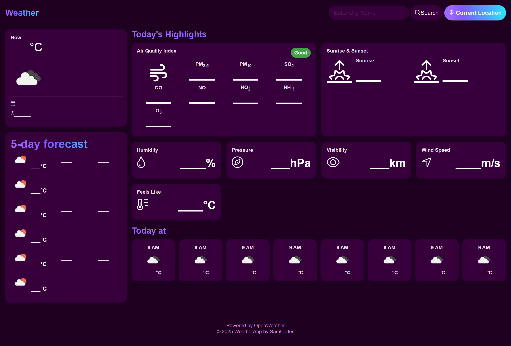
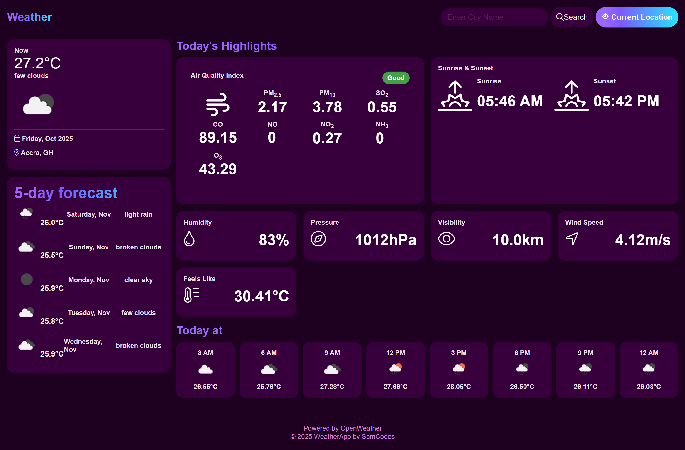
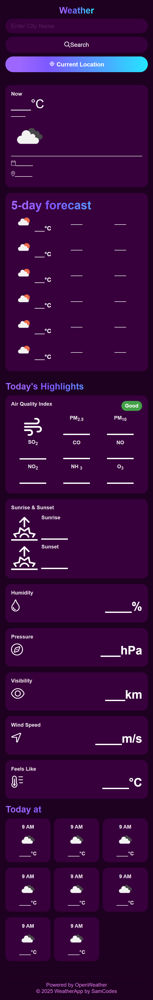

# 🌦 Weather App

A simple and responsive weather forecasting web application that provides real-time weather data for any city in the world.  
The app fetches live weather details such as temperature, humidity, wind speed, air quality index, and a 5-day forecast — all powered by the **[OpenWeatherMap API](https://openweathermap.org/api)**.

---

## 🚀 Features

- 🌍 Get current weather conditions and 5-day forecasts for any city  
- 📊 View Air Quality Index (AQI) with color-coded indicators  
- 📱 Fully responsive layout for mobile and desktop  
- 📡 Auto-detect your location for instant weather updates  
- 🌅 Displays sunrise, sunset, and hourly forecasts  

---

## 🛠 Technologies Used

- **HTML5** – form structure and layout  
- **CSS3** – styling and responsive design 
- **JavaScript (ES6)** – fetches, processes, and updates weather data on the page.  
- **OpenWeatherMap API** – provides accurate and up-to-date weather information, air quality data, and forecasts.

---

## ⚙️ Setup Instructions

### 1. Get Your OpenWeather API Key
1. Go to the [OpenWeatherMap API website](https://openweathermap.org/api).
2. Sign up for a free account and generate an API key under your dashboard.
3. Copy your personal API key.

### 2. Add the API Key Securely to Your Project
Since this project doesn’t use an `.env` file, we’ll store the key using a separate `config.js` file that is **not pushed to GitHub**.

#### Steps:
1. Inside your project directory, create a folder named `js` if it doesn’t already exist.
2. Create a new file inside it called `config.js`.
3. Add your API key in this format:
   ```javascript
   const apiKey = 'your_api_key_here';
   ```
4. In your main JavaScript file (`script.js`), import or reference this variable:
   ```javascript
   let api_key = typeof apiKey !== "undefined" ? apiKey : "";
   ```
5. Create a `.gitignore` file (if you don’t already have one) and add:
   ```
   js/config.js
   ```
   This ensures your API key remains private and isn’t uploaded to GitHub.

---

## 🖼 Screenshots

### 🖥 Desktop View — Before Search


### 🖥 Desktop View — After Search


### 📱 Mobile View (Responsive) — Before Search


### 📱 Mobile View (Responsive) — After Search


---

## 📦 Deployment (Live Demo)

🔗 **Live Site:** [https://sammyb27.github.io/weather-app](https://sammyb27.github.io/weather-app)

---

## 📌 Notes

- Default temperature unit from the API is **Kelvin**, converted to **Celsius** within the app.  
- The **free plan** of OpenWeatherMap limits API requests per minute. Upgrade your plan for higher usage.  
- ⚠️ **Security Tip:** Never expose your API key publicly on GitHub.  
  If deploying beyond GitHub Pages, use environment variables or a backend proxy to protect your credentials.

---

## 🧠 Author

**Developed by:** [@sammyb27](https://github.com/sammyb27)  
**Powered by:** [OpenWeatherMap](https://openweathermap.org/api)
