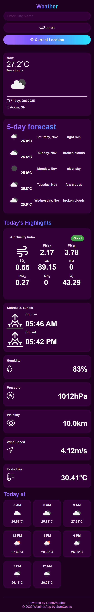

# Weather App

A simple and responsive weather forecasting web application
that provides real-time weather data for any city in the world.
The app fetches live weather details such as **temperature**, **humidity**,
**wind speed**, **air quality index**, and a **5-day forecast**,
powered by `OpenWeatherMap API`.

---

## Features

- Get current weather conditions and 5-day forecasts for any city

- View Air Quality Index (AQI) with color-coded indicators

- Fully responsive layout for mobile and desktop

- Auto-detects your location for instant weather updates

- Display sunrise, sunset, and hourly forecasts

---

## Technologies Used

- **HTML5** – form structure and layout

- **CSS3** – styling and responsive design

- **JavaScript** – fetch, process, and update weather data

- **Node.js + Express** – creates a backend server used to securely
access OpenWeather API

- **Render** – hosting platform for the backend server

- **OpenWeatherMap API** – accurate and up-to-date weather information

---

## Setup Instructions

This section guides you through setting up the frontend, backend,
and API key, and connecting everything together.

---

### 1. Clone the Repository

- Open your terminal and clone the project:

```bash
git clone https://github.com/sammyb27/weather-app.git
```

- Run this command to enter the project folder:

```bash
cd weather-app
```

---

### 2. Create Your OpenWeather API Key

- Go to the [OpenWeatherMap website](https://openweathermap.org/)

- Create an account (free)

- After signing in, go to the Dashboard and select `API keys`

- Generate and Copy your personal API key

You can use [this video](https://www.youtube.com/watch?v=xUbdspm1H2I)
as a guide.

---

### 3. Backend Setup (Node.js)

- #### Install dependencies

In the **backend folder**, run this command:

```bash
npm install
```

- #### Create an .env file

  - In the **backend folder**, create an `.env` file

  - Add the **API key (generated from OpenWeatherMap)** to the file
  - Add  `PORT=5000` to the file

```bash
PORT=5000

OPEN_WEATHER_API_KEY=your_api_key_here
```

> **Note:**
> The`node_modules` folder and `.env` file should never be committed to version control,
>i.e., **Git**, in this instance, or pushed to **GitHub**.

- #### Run the backend locally

  - Run this command to start the server:

```bash
node server.js
```

Expected output:

```bash
Server running on port 5000
```

This confirms the backend works.

- #### Test backend locally

Open your browser and visit these links:

```cmd
http://localhost:5000/weather?lat=5.6&lon=-0.2

http://localhost:5000/forecast?lat=5.6&lon=-0.2
```

If you see **JSON output**, the backend is working correctly.

---

### 4. Deploy Backend to Render

- #### Visit [Render: Cloud Application Platform](https://render.com) and sign in

- #### Click the `New +` button in the dashboard and select `Web Service`

- #### Render will prompt you to connect your Github account

- #### Select the repository containing the backend code

- #### Configure Service Settings - Fill the fields with the required values <br><br>This [video](https://www.youtube.com/watch?v=A2VoUyZZMCw) offers a visual guide of the process
  
> **Note:**
>
>- At the **Environment Variables** section, manually add the `OPEN_WEATHER_API_KEY`
>and paste the exact secret key you generated from OpenWeatherMap as its value.
>
> - Do not add the `PORT=5000` variable here,
>as Render automatically handles the port.

- #### Deployment

  - Click `Deploy Web Service` - Render pulls the code, runs the build command,
  and starts the backend service using the provided configurations
  - Once the deployment is complete, you will receive a public URL:

```powershell
https://your-app-name.onrender.com
```

### 5. Connect Frontend to the Backend

- #### Copy the URL from Render and add it to `config.js`

```bash
const BACKEND_BASE_URL= "https://your-app-name.onrender.com";
```

This replaces direct calls to OpenWeather and routes everything through your backend.

---

### 6. Test Application and Push to Github

- #### Open `index.html` in your browser (or use VSCode Live Server)

- #### Search for any city to test against your live Render backend

Once this test passes ( .ie. you get weather forecast for a selected city), you can push
your frontend to GitHub Pages.

---

## Screenshots

### Desktop View — Before Search


### Desktop View — After Search


### Mobile View (Responsive) — Before Search

<p align="center">
  
</p>

### Mobile View (Responsive) — After Search

<p align="center">
  
</p>

---

## Deployment (Live Demo)

[Access the Live Site Here](https://sammyb27.github.io/weather-app/frontend/)

---

## Notes

- The`node_modules` folder and `.env` file (containing the API key), should never
be committed to version control, i.e., **Git**, or pushed to **GitHub**

- Render (Cloud Application Platform) may pause on
 free tier (first request may be slow)

- For heavy usage, upgrade your OpenWeather API plan

---

## Author

- **Developed by:** [@sammyb27](https://github.com/sammyb27)

- **Powered by:** [OpenWeatherMap](https://openweathermap.org/api)

---
